<picture>
  <source media="(prefers-color-scheme: dark)" srcset="assets/banner-dark.svg">
  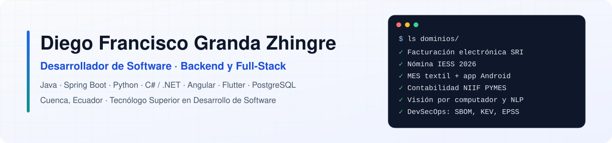
</picture>

  
  
  

## Sobre mí

Soy **Tecnólogo Superior en Desarrollo de Software** (Instituto Superior Tecnológico del Azuay, 2026). Construyo software empresarial para Ecuador a partir de la norma oficial: facturación electrónica del SRI, nómina con IESS y Código del Trabajo, contabilidad NIIF para PYMES con el catálogo de la Supercias y protección de datos con la LOPDP.

- **Experiencia:** prácticas preprofesionales en **RENAFIPSE** (Red Nacional de Finanzas Populares y Solidarias del Ecuador), diciembre de 2025 a febrero de 2026: bases de datos y desarrollo en Java con NetBeans.
- **Busco:** mi primer empleo como desarrollador backend o full-stack (Java y Spring Boot, C# y .NET, Python). Presencial en Cuenca, híbrido o remoto.
- **Cómo trabajo:** investigo en fuentes oficiales, derivo el modelo de datos de esa investigación y entrego con pruebas automatizadas, CI con escaneo de secretos, Docker y despliegue gratuito.

## Proyectos destacados (2026)

<table>
  <tr>
    <td width="50%" valign="top">
      <a href="https://github.com/DiegoFranciscoG/textrack">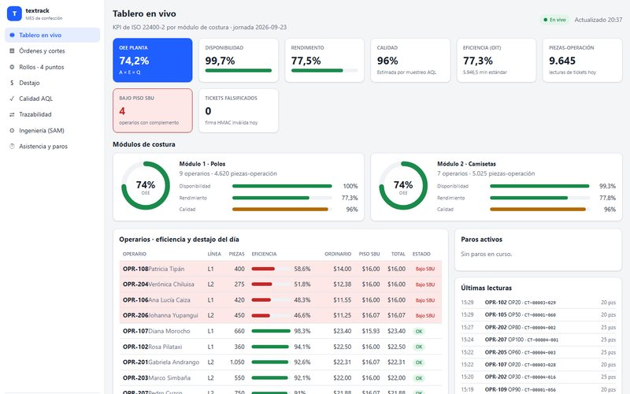</a>
      
<b><a href="https://github.com/DiegoFranciscoG/textrack">textrack</a></b> · MES para plantas de confección

      
Orden de producción → bulto → prenda con tickets QR firmados (HMAC), app Android que escanea sin conexión, pago a destajo según el Código del Trabajo y OEE en vivo (ISO 22400-2).

      Java 25 · Spring Boot 4 · Angular 22 · Kotlin y Compose · PostgreSQL
    </td>
    <td width="50%" valign="top">
      <a href="https://github.com/DiegoFranciscoG/facturador-sri">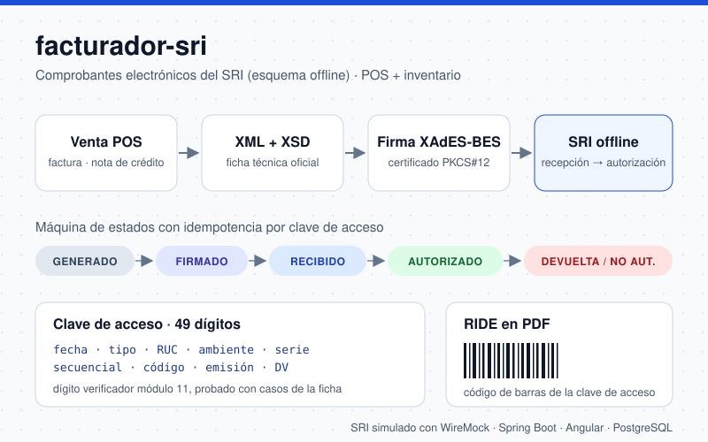</a>
      
<b><a href="https://github.com/DiegoFranciscoG/facturador-sri">facturador-sri</a></b> · POS con facturación electrónica

      
Facturas y notas de crédito según el esquema offline del SRI: clave de acceso de 49 dígitos, XML validado con XSD, firma XAdES-BES, recepción y autorización, y RIDE en PDF.

      Spring Boot 4 · Angular 22 · PostgreSQL · WireMock · Testcontainers
    </td>
  </tr>
  <tr>
    <td width="50%" valign="top">
      <a href="https://github.com/DiegoFranciscoG/vuln-manager">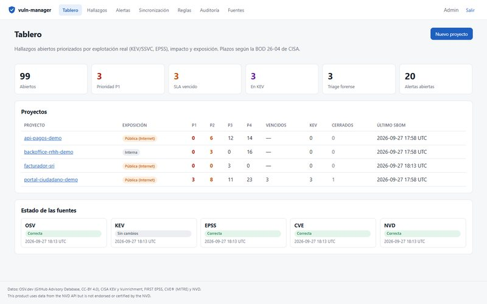</a>
      
<b><a href="https://github.com/DiegoFranciscoG/vuln-manager">vuln-manager</a></b> · Priorización de vulnerabilidades

      
Ingesta SBOM CycloneDX, cruza con OSV.dev y enriquece con CISA KEV, SSVC, EPSS y NVD. Prioriza con una tabla de decisión explicable, plazos de la BOD 26-04 y VEX con justificación.

      C# · .NET 10 · Blazor · EF Core · PostgreSQL
    </td>
    <td width="50%" valign="top">
      <a href="https://github.com/DiegoFranciscoG/vision-defectos-tela">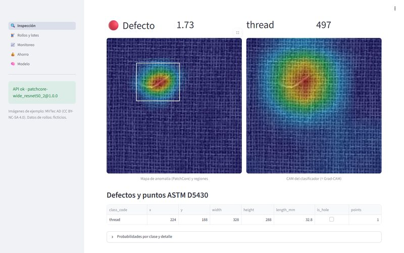</a>
      
<b><a href="https://github.com/DiegoFranciscoG/vision-defectos-tela">vision-defectos-tela</a></b> · Visión por computador y MLOps

      
Detecta y localiza defectos en tela con PatchCore y los convierte en la decisión de calidad de la industria: 4 puntos ASTM D5430 por rollo y AQL ISO 2859-1 por lote. API, MLflow y monitoreo de drift.

      Python · PyTorch · ONNX Runtime · FastAPI · Streamlit
    </td>
  </tr>
  <tr>
    <td width="50%" valign="top">
      <a href="https://diegofranciscog.github.io/PEUC/">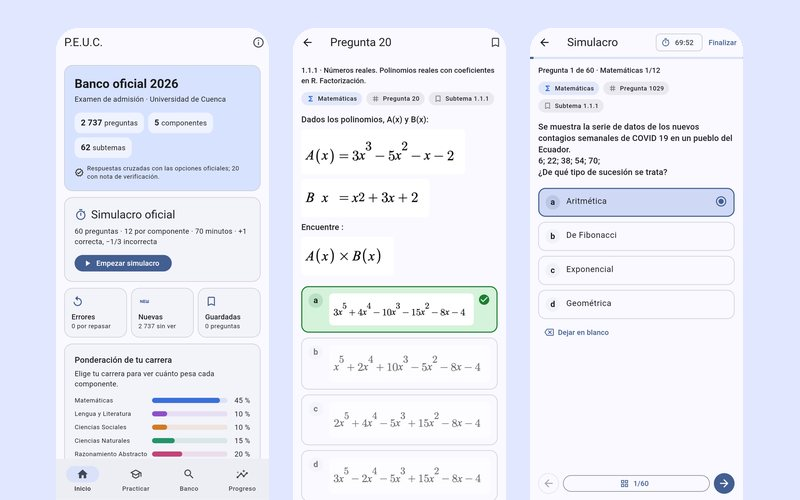</a>
      
<b><a href="https://github.com/DiegoFranciscoG/PEUC">PEUC</a></b> · App para el examen de admisión de la UCuenca · <a href="https://diegofranciscog.github.io/PEUC/">demo en vivo</a>

      
Las 2737 preguntas del banco oficial 2026 con respuestas verificadas, justificaciones y simulacros con la calificación real. Android, iPhone y web, sin conexión.

      Flutter · Dart · SQLite · Python (pipeline de datos)
    </td>
    <td width="50%" valign="top">
      <a href="https://github.com/DiegoFranciscoG/nlp-tickets-es">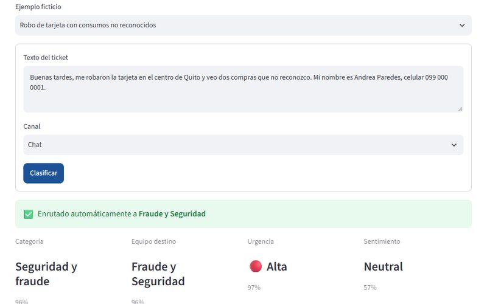</a>
      
<b><a href="https://github.com/DiegoFranciscoG/nlp-tickets-es">nlp-tickets-es</a></b> · Clasificación de tickets en español

      
Intención, categoría, urgencia y sentimiento con revisión humana cuando el modelo duda. Anonimiza cédulas, RUC, teléfonos y nombres antes de guardar (LOPDP) y busca casos parecidos con pgvector.

      Python · FastAPI · ONNX Runtime INT8 · PostgreSQL y pgvector
    </td>
  </tr>
  <tr>
    <td width="50%" valign="top">
      <a href="https://github.com/DiegoFranciscoG/crm-ventas">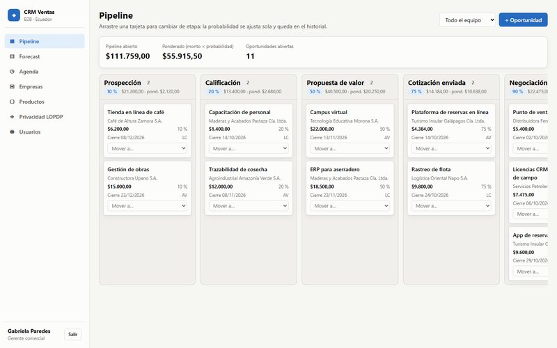</a>
      
<b><a href="https://github.com/DiegoFranciscoG/crm-ventas">crm-ventas</a></b> · CRM B2B con cumplimiento LOPDP

      
Pipeline kanban, cotizaciones en PDF con IVA del SRI, forecast de ventas, registro de consentimientos, derechos del titular y log inmutable de accesos a datos personales.

      Java 25 · Spring Boot 4 · Angular 22 · PostgreSQL
    </td>
    <td width="50%" valign="top">
      <a href="https://github.com/DiegoFranciscoG/contabilidad-api">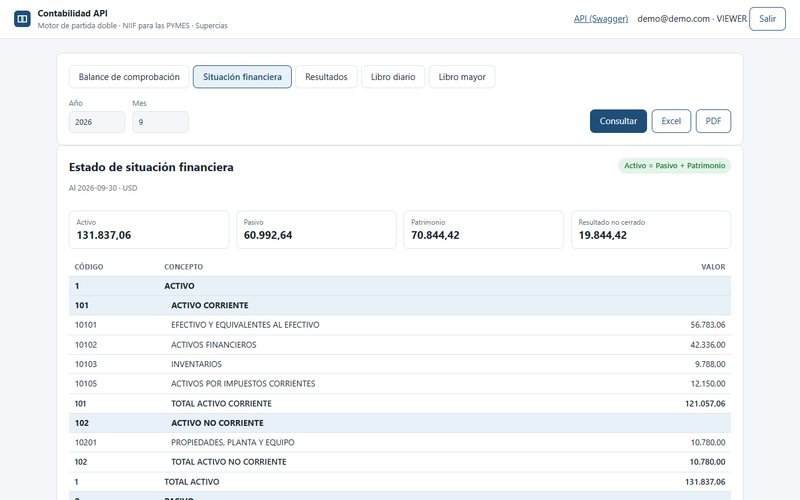</a>
      
<b><a href="https://github.com/DiegoFranciscoG/contabilidad-api">contabilidad-api</a></b> · Motor de partida doble

      
Plan de cuentas de la Supercias, asientos que no se guardan si no cuadran, cierre de periodos y estados financieros NIIF para las PYMES en Excel y PDF. Tests por propiedades con jqwik.

      Java 25 · Spring Boot 4 · PostgreSQL · jqwik · Testcontainers
    </td>
  </tr>
  <tr>
    <td width="50%" valign="top">
      <a href="https://github.com/DiegoFranciscoG/nomina-ec">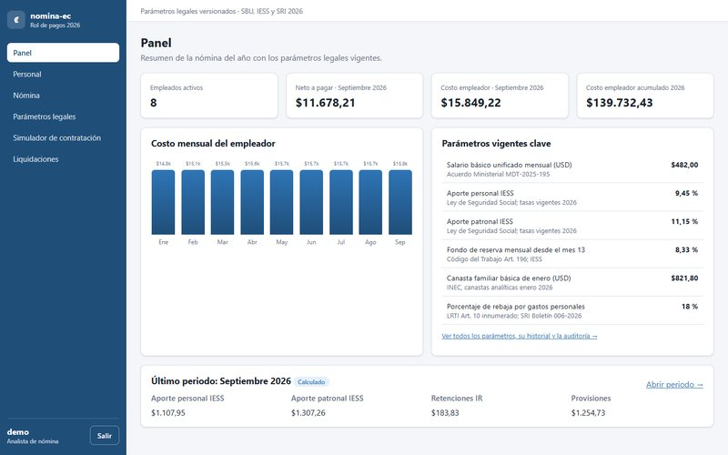</a>
      
<b><a href="https://github.com/DiegoFranciscoG/nomina-ec">nomina-ec</a></b> · Rol de pagos ecuatoriano 2026

      
IESS, décimos, fondos de reserva, vacaciones e impuesto a la renta con parámetros legales versionados por fecha: si cambia el SBU, se registra una vigencia nueva sin recompilar.

      Java 21 · Spring Boot · Angular 22 · PostgreSQL
    </td>
    <td width="50%" valign="top">
      <a href="https://github.com/DiegoFranciscoG/inventario-multibodega">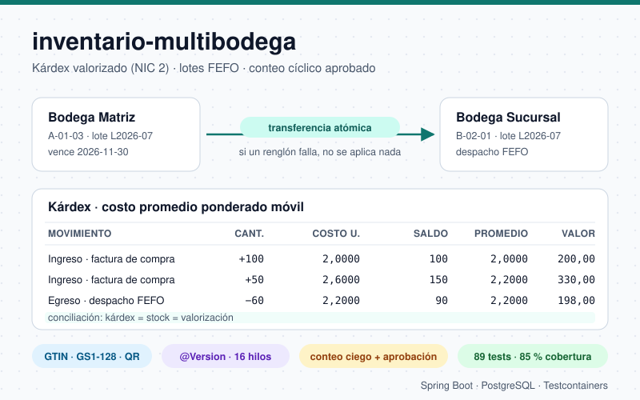</a>
      
<b><a href="https://github.com/DiegoFranciscoG/inventario-multibodega">inventario-multibodega</a></b> · WMS con kárdex

      
Kárdex valorizado con costo promedio (NIC 2), lotes con despacho FEFO, transferencias atómicas, conteo cíclico aprobado por otra persona y lectura de códigos GS1 y QR.

      Java 25 · Spring Boot 4 · PostgreSQL · Testcontainers
    </td>
  </tr>
</table>

### Otros proyectos

| Proyecto | Qué es | Stack |
|---|---|---|
| [HuellitasInteligentes](https://github.com/DiegoFranciscoG/HuellitasInteligentes) | Proyecto de titulación: plataforma IoT para el cuidado de mascotas con app móvil, web y dispositivos ESP32 | Spring Boot · Angular · Flutter · ESP32 · PostgreSQL |
| [athletesos](https://github.com/DiegoFranciscoG/athletesos) | App personal de aprendizaje: calistenia, artes marciales, ajedrez, vocabulario y trivia | Flutter · Spring Boot · PostgreSQL |
| [sistema-matricula-backend](https://github.com/DiegoFranciscoG/sistema-matricula-backend) | API REST de matrícula estudiantil | Spring Boot · JPA · MySQL |
| [ProyectoNube](https://github.com/DiegoFranciscoG/ProyectoNube) | Gestor de tareas con API REST documentada en OpenAPI | Spring Boot · MongoDB · React |
| [ENDPOINTEVALUACION](https://github.com/DiegoFranciscoG/ENDPOINTEVALUACION) | API académica de departamentos, profesores y cursos | Java 21 · Spring Boot 4 · MongoDB · Docker |
| [ServicioWEBSoapTaxi](https://github.com/DiegoFranciscoG/ServicioWEBSoapTaxi) | Publicación y consumo de servicios web SOAP con contrato WSDL | Java · SOAP · WSDL |

## Stack

| Área | Tecnologías |
|---|---|
| Backend |       |
| Frontend y móvil |      |
| Datos e IA |        |
| Calidad y DevOps |      |
| Seguridad y nube |     |

<picture>
  <source media="(prefers-color-scheme: dark)" srcset="assets/languages-dark.svg">
  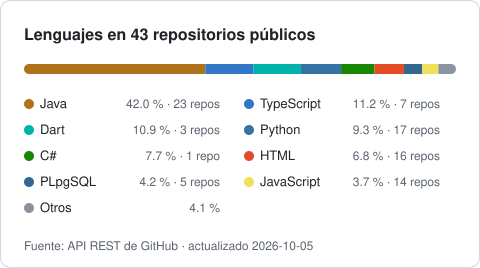
</picture>

## Formación y certificaciones

**Tecnólogo Superior en Desarrollo de Software** · Instituto Superior Tecnológico del Azuay, Cuenca · 2026

Certificaciones con enlace de verificación:

- **Nube:** [AWS Technical Essentials](https://skillbuilder.aws/learn/K8C2FNZM6X/aws-technical-essentials-espaol-latam/2D4C2B2516) · [Getting Started with Google Kubernetes Engine](https://www.cloudskillsboost.google/public_profiles/04c17f59-c775-4c12-b411-5f681170dfa7/badges/8335301) · [Essential Google Cloud Infrastructure: Core Services](https://www.cloudskillsboost.google/public_profiles/04c17f59-c775-4c12-b411-5f681170dfa7/badges/8289377)
- **Programación:** [Scientific Computing with Python](https://freecodecamp.org/certification/woasous/scientific-computing-with-python-v7) · [JavaScript Algorithms and Data Structures](https://freecodecamp.org/certification/woasous/javascript-algorithms-and-data-structures-v8) · [Responsive Web Design](https://freecodecamp.org/espanol/certification/woasous/responsive-web-design)
- **Datos:** [Data Visualization with Power BI](https://www.mygreatlearning.com/certificate/HUUEZLFP) · [Introduction to Data Analytics](https://simpli-web.app.link/e/f92o5YNRQIb)

Ver todas las certificaciones

**Nube e infraestructura**
- [AWS Technical Essentials (Español LATAM)](https://skillbuilder.aws/learn/K8C2FNZM6X/aws-technical-essentials-espaol-latam/2D4C2B2516) · AWS Training & Certification · 2026
- [Set oficial de práctica AWS Certified Cloud Practitioner (CLF-C02)](https://skillbuilder.aws/learn/E4W52ZKK6P/official-practice-question-set-aws-certified-cloud-practitioner-clfc02--espaol-latam/X5TCJA7KQV) · AWS Training & Certification · 2026
- [Essential Google Cloud Infrastructure: Core Services](https://www.cloudskillsboost.google/public_profiles/04c17f59-c775-4c12-b411-5f681170dfa7/badges/8289377) · Google Cloud · 2024
- [Getting Started with Google Kubernetes Engine](https://www.cloudskillsboost.google/public_profiles/04c17f59-c775-4c12-b411-5f681170dfa7/badges/8335301) · Google Cloud · 2024
- [Perform Foundational Infrastructure Tasks in Google Cloud](https://www.cloudskillsboost.google/public_profiles/04c17f59-c775-4c12-b411-5f681170dfa7/badges/6942617) · Google Cloud · 2024
- [Google Cloud Computing Foundations: Networking](https://www.cloudskillsboost.google/public_profiles/04c17f59-c775-4c12-b411-5f681170dfa7/badges/6729527) · Google Cloud · 2023
- [Google Cloud Computing Foundations: Infrastructure in Google Cloud](https://www.cloudskillsboost.google/public_profiles/04c17f59-c775-4c12-b411-5f681170dfa7/badges/6684924) · Google Cloud · 2023
- [Google Cloud Computing Foundations: Cloud Computing Fundamentals](https://www.cloudskillsboost.google/public_profiles/04c17f59-c775-4c12-b411-5f681170dfa7/badges/6604631) · Google Cloud · 2023
- [Cloud Computing](https://skillshop.exceedlms.com/student/award/8p8NWQ8m8qcptrZ25odujvMg) · Google · 2023
- [Introduction to Generative AI](https://www.cloudskillsboost.google/public_profiles/04c17f59-c775-4c12-b411-5f681170dfa7/badges/5986729) · Google Cloud · 2023

**Desarrollo de software y web**
- [Java Fundamentals Course For Beginners](https://www.udemy.com/certificate/UC-1baf6d53-8698-4557-a049-8031f9486556/) · Udemy · 2024
- [Bootstrap & React Bootcamp with Hands-On Projects](https://www.udemy.com/certificate/UC-585a9d40-28fa-4064-8f83-2118b43853c7/) · Udemy · 2024
- [Python Demonstrations For Practice Course](https://www.udemy.com/certificate/UC-7e472bf9-60f3-41e5-8f57-18fa44e1b52e/) · Udemy · 2024
- [JavaScript Algorithms and Data Structures](https://freecodecamp.org/certification/woasous/javascript-algorithms-and-data-structures-v8) · freeCodeCamp · 2024
- [Responsive Web Design](https://freecodecamp.org/espanol/certification/woasous/responsive-web-design) · freeCodeCamp · 2024
- [JavaScript](https://www.sololearn.com/certificates/CC-ZPM9DJ77) · Sololearn · 2025
- [CSS Avanzado](https://cursos.desafiolatam.com/certificates/p1br09o0fl) · Desafío Latam · 2024
- [Front End Development: HTML](https://www.mygreatlearning.com/certificate/KLXXUIGU) · Great Learning · 2024
- [Front End Development: CSS](https://www.mygreatlearning.com/certificate/NDSXKLTT) · Great Learning · 2024
- [Bases de Git y GitHub](https://cursos.desafiolatam.com/certificates/geovpuzfqx) · Desafío Latam · 2024
- [Logro en Microsoft Learn](https://learn.microsoft.com/en-us/users/diegofranciscograndazhingre-5198/achievements/45qn8ack) · Microsoft · 2024
- [Introducción a las habilidades profesionales en el desarrollo de software](https://www.linkedin.com/learning/certificates/e58869164078c2d4f3cabd480691aea55c9543666259ea76615db55fa90714c5) · LinkedIn Learning · 2023
- [Fundamentos esenciales de la programación](https://www.linkedin.com/learning/certificates/039a47f82ef9805ee181b724df77d5c75bac6db0f7eb7ce37f9aebbde2a0fa61) · LinkedIn Learning · 2023
- [Fundamentos de la programación: más allá de lo básico](https://www.linkedin.com/learning/certificates/0aeb58980b70329f4c414e1ad70267848bb92fe917e0becb7d8f613c297dfb21) · LinkedIn Learning · 2023
- Curso de Introducción al Desarrollo Web: HTML y CSS · Google · 2022

**Datos y BI**
- [Scientific Computing with Python](https://freecodecamp.org/certification/woasous/scientific-computing-with-python-v7) · freeCodeCamp · 2025
- [Data Visualization with Power BI](https://www.mygreatlearning.com/certificate/HUUEZLFP) · Great Learning · 2024
- [Use Excel Spreadsheets with Python](https://www.udemy.com/certificate/UC-ca0cacd7-6974-421f-9b88-ebfe99aa06a1/) · Udemy · 2024
- [Introduction to Data Analytics](https://simpli-web.app.link/e/f92o5YNRQIb) · Simplilearn · 2024

**Complementarias**
- [Ciberseguridad en la era digital: protección de datos y desafíos emergentes](https://cursos.desafiolatam.com/certificates/7ddvxsb4d5) · Desafío Latam · 2024
- [English for Developers & IT Professionals](https://cursos.desafiolatam.com/certificates/boad1qvy6b) · Desafío Latam · 2024
- Introducción a IoT · Cisco · 2023
- Advanced Microsoft Word · Udemy · 2025
- Fundamentos de Marketing Digital · Google · 2022

Lista completa en [LinkedIn](https://www.linkedin.com/in/diego-francisco-g-61b793254/details/certifications/).

## Contacto

[LinkedIn](https://www.linkedin.com/in/diego-francisco-g-61b793254/) · [Portafolio](https://diegofranciscog.github.io/) · Cuenca, Ecuador · Español nativo, inglés técnico
